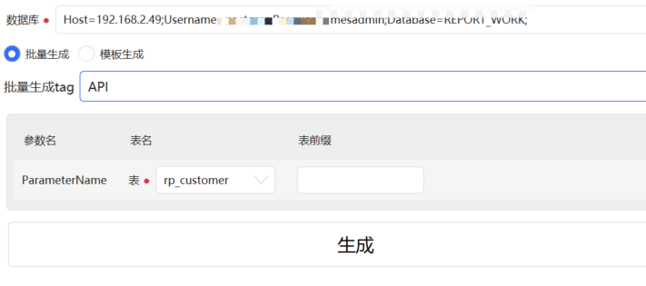

# 使用T4模板自动生成需要的数据库实体类、仓储类、仓储接口

提供的项目  

0. CommonGenerate - ***最新版本的生成工具***，底层支持跨数据库，暂时适配了oracle、postgresql，基于.netcore，使用了动态的T4执行方案，不依赖vs环境
1.  ~~AutoInfrastructGenerate(旧项目)~~ - 提供基础生成实体(实体基础结构-不读取数据库-可手动扩展读取特定数据库实体类型)、仓储 -T4模板
2.  ~~GenEntities-Mysql(旧项目)~~ - 读取mysql中的表自动生成实体及仓储
3.  ~~OracleGenerate(旧项目)~~ - 读取oracle中的表自动生成实体 -读取oracle基表


### CommonGenerate
分为服务端和客户端，服务端解析数据库、表字段等信息，客户端负责生成逻辑，可以在客户端通过添加T4模板文件的方式新增生成模板。


#### 服务端 - CommonGenerateServer
主项目为Server.WebAPI，需要在配置文件【appsettings.json】中添加数据库信息，可参考现有配置添加


#### 客户端 - CommonGenerateClient
主项目为CommonGenerateClient.Win，需要在配置文件【appsettings.json】中添加服务端信息，维护API字段即可。  
如果需要添加自定义模板只需要在配置文件中Template节点中维护模板路径即可，模板为T4模板。  

选择模板后将根据模板配置需要的表数量要求选择的表(z界面中显示为参数)，参数的现实依据为所选的模板类型中所有的TableParameterName去重得到。

需要注意模板执行方式有两种，
1. 根据维护的模板批量执行，将多个模板维护在Template中同一个对象内部，参考现有配置文件。
2. 单个执行指定的模板


部分参数
```
{
  "Name": "EntityGenerate", //模板名称
  "Path": "T4s\\Api\\Common\\EntityGenerate.tt",//模板所在路径(程序路径下的位置)
  "TemplatePath": "\\WebAPI\\Entities",//生成后的模板路径(多个模板可以分别生成在不同路径，生成路径的基础路径为生成时手动选择，随后在选择的目录中再生成配置的子目录再将生成后的模板内容存放到这个子目录)
  "FileNameTemplate": "{0}Entity",//生成的文件名称
  "FileExt": ".cs",//生成的文件后缀名
  "TableParameterName": [ "ParameterName" ]//需要的表参数名称，无具体意义仅做标识，同一个参数名代表同一个选择的表
}
```

### ~~AutoInfrastructGenerate(旧项目)~~
1. Entity.tt中提供了主要的逻辑
2. Manager.ttinclude中提供了文件相关操作
3. 主要逻辑都在模板中,使用过程需要调整模板中tableName字段及其他相关字段,随后在vs中保存以触发生成逻辑

### ~~GenEntities-Mysql(旧项目)~~
对GenEntities进行mysql适配后的版本,使用方法与GenEntities一致

### ~~OracleGenerate(旧项目)~~
1. 在GenEntities基础上适配oracle后开发的windows gui工具
2. 将数据库连接字符串调整到配置文件中


### QA 
如果遇到类型“DTE”同时存在于“EnvDTE, Version=8.0.0.0, Culture=neutral, PublicKeyToken=b03f5f7f11d50a3a”和“Microsoft.VisualStudio.Interop, Version=17.0.0.0, Culture=neutral, PublicKeyToken=b03f5f7f11d50a3a”中	
，可以移除Manager.ttinclude内的<#@ assembly name="EnvDTE" #>


### ~~OracleGenerate(旧项目)~~~
配置文件 - 数据库连接字符串


生成架构按钮将调用OracleGenerate目录下的Infrastruct.tt模板生成基础的架构  
需要调整对应的配置如下图

后续将调整为配置--暂未处理

### 原理
#### oracle
```
-- 获取用户创建的表
select table_name from user_tables 
select * from user_tables where Table_Name = 'T_USER';

--获取表字段
select* from user_tab_columns where Table_Name = 'T_USER';

--获取表注释
select* from user_tab_comments user_tab_comments where Table_name='T_USER';

--获取字段注释
select * from user_col_comments where Table_name='T_USER';

--获取主键
select * --col.column_name 
from user_constraints con,  user_cons_columns col 
where con.constraint_name = col.constraint_name 
and con.constraint_type='P' 
and col.table_name = 'T_USER'
```

#### postgre
获取数据库中所有view名 视图
```
SELECT * FROM pg_views  
WHERE schemaname ='public'
```

获取数据库中所有table名 表
```
SELECT * FROM pg_tables  
WHERE tablename NOT LIKE 'pg%' AND tablename NOT LIKE 'sql_%'
ORDER BY tablename;
```

获取表注释
```
select relname as tabname,cast(obj_description(relfilenode,'pg_class') as varchar) as comment from pg_class c
where relkind = 'r' and relname not like 'pg_%' and relname not like 'sql_%' order by relname
```

获取某个表tablename 所有字段名称 ， 类型，备注,是否为空
```
SELECT 
        col_description(a.attrelid,a.attnum) as comment,
		pg_type.typname as typename,
		a.attname as name, 
		a.attnotnull as notnull
FROM 
    pg_class as c,pg_attribute as a 
inner join pg_type on pg_type.oid = a.atttypid
where 
    c.relname = 'xxxx' and a.attrelid = c.oid and a.attnum>0
```

获取某个表tablename 的主键信息
```
select 
        pg_attribute.attname as colname,
		pg_type.typname as typename,
		pg_constraint.conname as pk_name 
from pg_constraint  
inner join pg_class on pg_constraint.conrelid = pg_class.oid 
inner join pg_attribute on pg_attribute.attrelid = pg_class.oid and  pg_attribute.attnum = pg_constraint.conkey[1]
inner join pg_type on pg_type.oid = pg_attribute.atttypid
where pg_class.relname = 'bd_basic_data_type' and pg_constraint.contype='p'
```

### mysql
获取表
```
show tables
```

获取表中的字段
```
DESCRIBE t_admin
```


### 基本数据配置
```
string baseNamespaceName="MES.Server.Manufacture"; //基础名称空间
    string entityNamespaceName="Domain.Entity"; //实体名称空间
    string repositoryNamespaceName="Infrastruct.Repository"; //仓储名称空间
    string iRepositoryNamespaceName="Domain.IRepository"; //仓储接口名称空间
    string tableDesc="测试表";
    string tableName="t_pd_wo_issue_material";
    string entityFileName="WorkorderIssueMaterial"; //实体基本名称
    string entityName=entityFileName+"Entity"; //实体文件名称
    string repositoryName=entityFileName+"Repository"; //仓储名称
    string iRepositoryName="I"+repositoryName; //仓储基类

    var manager = Manager.Create(Host, GenerationEnvironment);

    bool isBaseRepository=true; //是否生成基础仓储模型
```

### 文件相关操作
```
var manager = Manager.Create(Host, GenerationEnvironment);
//开始文件写入,后续输出将写入此文件
manager.StartNewFile(entityName + ".cs","Entities"); //Entities为保存的目录名称

manager.EndBlock(); //结束当前文件写入

manager.Process(true); //解析文件,将生成的数据导入配置的文件中
```

### ~~GenEntities-Mysql(旧项目)~~~
主要逻辑在Generate.tt文件中

另外Manager.ttinclude文件中包含了创建文件的操作,使用此方法需要将Generate.tt文件中hostspecific设置为true
```
<#@ template debug="false" hostspecific="true" language="C#" #>
```

##更新
1. 添加对仓储模式自动生成的支持,可用通过修改Generate.tt文件中的needRepository改为true生成实体对应的仓储  
2. 可以配置仓储对应的实体类、仓储接口、仓储类、上下文类的名称空间以及上下文类的配置
```
//配置默认的名称空间
	var nameSpace="TestNameSpace";
	//实体类名称空间
	var EntityNameSpace="TestEntity";
	//仓储接口名称空间
	var IRepositoryNameSpace="TestRepository.IRepository";
	//仓库名称空间
	var RepositoryNameSpace="TestRepository.Repository";
	//上下文类
	var dbContextType="TestCommonContext";
	//上下文类名称空间
	var DBContext="TestRepository.DbContexts";
```

数据库的相关配置如下 
```
数据库连接
var connectionString = @"Server=127.0.0.1;port=3306;database=tianleclass;charset=utf8;uid=root;password=root";
// 需要解析的数据库
var database = new List<string> { "tianleclass" };
```
如需将生成的文件输出到指定的位置，可以找到manager.StartNewFile方法的调用  
第二个参数为希望生成的目录，基于项目目录的相对路径，尝试一下即可  
另外预留了WCF的配置  
```
// 是否是WCF服务模型
bool serviceModel = false;
```
